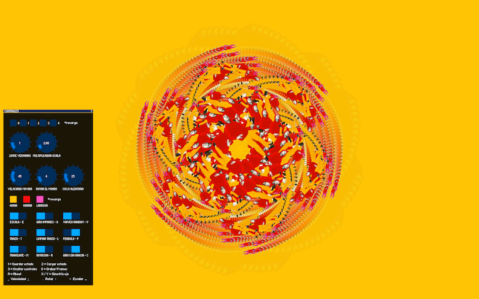

# Fractal Meneo Tools

## Resumen

El proyecto de colaboraación "meneo" con [Marisa mantxola](http://www.marisamantxola.com/)
consiste en la creación de una herramienta con la que la artista Marisa puede dar interactividad
a su material gráfico. Es un desarrollo basado en [processing](https://processing.org) donde los
Fractales son al forma matematica que usamos para esta interactividad y potencia grafica.

## Install

Processing [Descarga](https://processing.org/download/)
Cp5 Processing[cp5](http://www.sojamo.de/libraries/controlP5/)

### PRE

Para el proyecto Meneo de Marisa Mantxola se plantea hacer una herramienta de software ad
hoc que permita a la artista trabajar con complejas estructuras matemáticas, como son los
fractales, sin tener que hacer una generación y composición manual, que además de necesitar
un conocimiento matemático muy complejo exigiría un tiempo excesivo.
En este caso la inversión tanto temporal como económica en el desarrollo de una herramienta
específica ahorra mucho tiempo y esfuerzo en el proceso de creación de la obra, permitiendo a
la artista concentrarse en el proceso creativo y dejando a la máquina hacer los cálculos
matemáticos y la disposición de las figuras en estructuras fractales que dependerán de valores
que establecerá la artista mediante una interfaz gráfica simple.
La interfaz de la herramienta permitirá introducir valores que cambiarán las características de
las imágenes que se generen, permitiendo probar e iterar entre diferentes composiciones,
estructuras y movimientos. De la misma manera la herramienta permitirá exportar dichas
imágenes en formatos, tanto estáticos como en movimiento, para su posterior reproducción en
medios impresos o digitales.
En cualquier caso la forma y desarrollo definitivos de la herramienta dependerá de la
colaboración con la artista y de las necesidades que surjan en las fases previas del propio
proceso creativo, contemplando diferentes posibilidades como, por ejemplo, crear otro tipo de
estructuras o la generación de audio en base a la relación de estructura visual y sonora.

### POST

Para la creación de la herramienta generativa para el proyecto Meneo se empezó por investigar
las diferentes formas de creación y generación de formas fractales, y si realmente merecía la
pena trabajar con formas realmente fractales o si con construcciones circulares y efectos
caleidoscópicos sería suficiente. Finalmente se optó por trabajar con formas fractales reales y
generarlas utilizando la técnica de la recursión en diferentes niveles.
Una vez conseguida la base fractal se investigó la manera de situar y ordenar las imágenes en
los diferentes vectores generados, buscando la disposición, ángulo y escalas base que
permitieran subrayar la forma fractal concéntrica, manteniendo el todo fiel a los principios
estéticos y conceptuales del proyecto Meneo.
Sobre esta base se localizaron las diferentes variables a modificar para crear la interactividad y
generatividad de la pieza. Algunas de estas variables se establecieron como random y otras se
dejaron para modificar en vivo por la artista.
Finalmente se preparó una interfaz gráfica y se asignaron unas teclas que sirven de controles
para iterar entre las diferentes combinaciones de dichas variables.
La herramienta ha sido desarrollada en Processing, herramienta de código abierto, y será
publicada como tal para que quien quiera disponga de ella y su código fuente, con la idea de ir
desarrollándose con las aportaciones, tanto de los autores originales como cualquier otra
persona. La contribución del proyecto Meneo, al impulsar la creación de este software, va más
allá de las necesidades del propio proyecto, aportando a la comunidad global una herramienta
que seguirá creciendo y estará a disposición de cualquier artista o quien sea que quiera
utilizarla.

### BIO

Karlos G. Liberal aka [Patxangas](https://twitter.com/patxangas) y Martin [“txo!?”](https://twitter.com/txo_elurmaluta) Etxauri se encuentran en la intersección de la
tecnología y al arte. Siendo respectivamente un hacker venido a hacer proyectos artísticos y un
artista venido a usar herramientas tecnológicas se juntan para complementar y compartir
conocimiento en proyectos especulativos. Ambos son miembros del colectivo de
experimentación electro-artística Teknotrakitana y los hemos podido ver juntos coordinando las
tres ediciones de los encuentros organizados por el colectivo, impartiendo talleres de gráfica
generativa y código creativo, en proyectos como la instalación Persona Data para Upna 30,
Geodesia para el Centro de Arte contemporáneo de Huarte o Plaza Drone de Teknotrakitana,
así como haciendo live-coding y visuales en directo como Fourier Bizia Band o desarrollando
herramientas tecnológicas para otros artistas.
